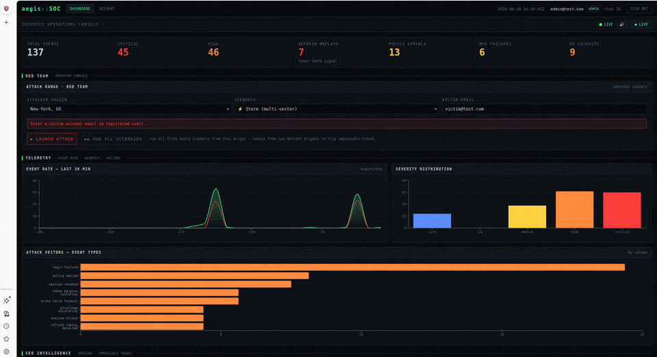
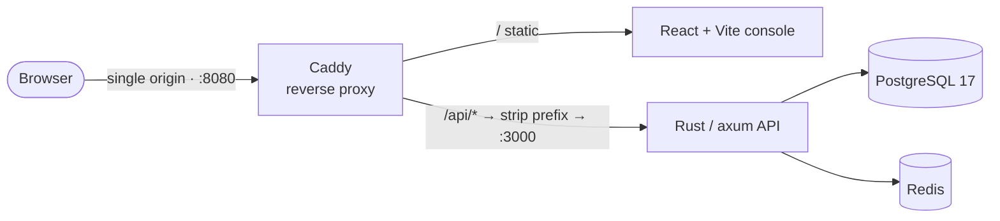
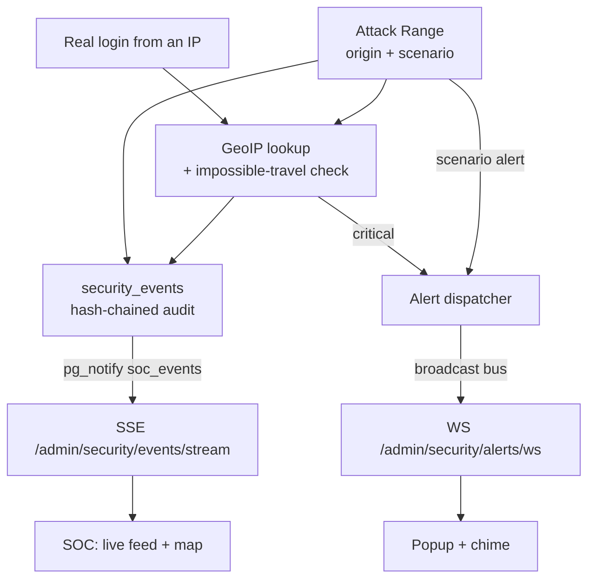
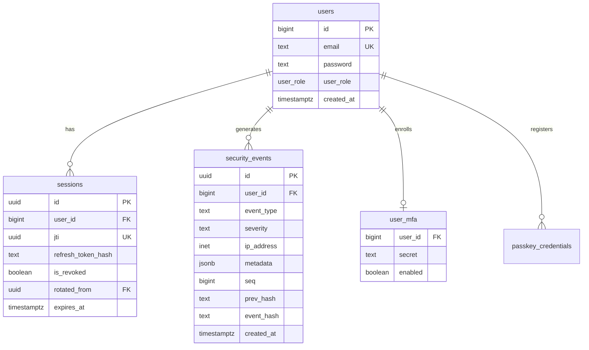

# Aegis

**Aegis — Zero-Trust Auth Lab & Attack Range.** A zero-trust identity provider with a built-in Security Operations Console (SOC).
The backend authenticates users, re-verifies every request, scores risk in real
time, and writes every security-relevant event into a tamper-evident audit log.
The admin console visualizes that telemetry live and lets you launch attacks
against the system to watch the defenses — and the detections — fire.




> ⚠️ A learning / portfolio project. Hardened in many places, but review before
> using any of it in production (and rotate every secret in the compose file).

---

## Features

**Identity & access**
- JWT (RS256) access tokens with `jti`, session binding, and **refresh-token
  rotation with replay detection** (a reused refresh token revokes the family).
- **RBAC** (`user` / `admin`).
- **TOTP MFA — mandatory for admins**: the SOC is gated behind enrollment.
- **Passkeys (WebAuthn)** — passwordless, phishing-resistant login. Both the
  registration and authentication ceremonies are verified server-side by
  [`webauthn-rs`](https://crates.io/crates/webauthn-rs); only public keys are
  stored, never a secret. See the [Passkeys](#passkeys-webauthn) section.

**Zero-trust risk engine (per request)**
- IP churn, device fingerprint, login velocity, session-family, and temporal
  signals combine into a 0–100 risk score that drives policy (allow / step-up / deny).
- **GeoIP impossible-travel detection**: a login or attack from a location too
  far, too fast (> 100 km and > 900 km/h since the last sighting) raises a
  critical `IMPOSSIBLE_TRAVEL` event.

**Detection & response**
- **Hash-chained audit trail** — every event is linked to the previous one, so
  tampering is detectable.
- **Real-time SOC**: events stream live (Postgres `LISTEN/NOTIFY` → SSE); alerts
  push over WebSocket as popups **with sound**; a world map plots origins and
  impossible-travel hops.
- **Attack Range**: pick an attacker **origin** + scenario and **launch** it from
  the dashboard — the events stream straight into the feed; launch from two
  distant origins to trip impossible-travel.

---

## Architecture



The API is a DDD-layered axum service (domain / application / infrastructure /
interface per module): `auth`, `mfa`, `passkeys`, `risk`, `audit`, `geo`,
`attack_range`, and `admin` (the SOC endpoints).

### Runtime flow (red → blue)



---

## Database schema

The schema is committed at **`docker/db-init/01_schema.sql`** (loaded automatically
by Postgres on first boot). Incremental migrations live in
`aegis-api/src/migration/` and `.../src/modules/*/migration/`. Core
security model:



A row inserted into `security_events` fires `pg_notify('soc_events', ...)`, which
the SSE endpoint relays to the dashboard — that's the real-time feed.

---

## Tech stack

| Layer | Tech |
| --- | --- |
| Backend | Rust, axum 0.8, sqlx (Postgres), Redis, argon2, jsonwebtoken (RS256), totp-rs |
| Frontend | React 19, Vite, React Router 7, Tailwind v4, Recharts |
| Data | PostgreSQL 17, Redis 7 |
| Delivery | Docker Compose, **Caddy** (single-origin reverse proxy / TLS-capable) |

---

## Quick start (Docker)

The repo ships the schema (`docker/db-init/01_schema.sql`) and the sqlx offline
cache (`aegis-api/.sqlx`), so a clone builds and runs as-is:

```bash
docker compose up -d --build           # Postgres + Redis + API + Caddy(web)
docker compose --profile seed run --rm seed  # seed admin@test.com / victim@test.com
# open http://localhost:8080
```

Optionally run with **Vault**-issued dynamic, short-lived DB credentials instead
of the static password (see [`VAULT.md`](./VAULT.md)):

```bash
docker compose -f docker-compose.yml -f docker-compose.vault.yml up -d --build
```

Then: sign in as **admin@test.com / AdminPass123!** → you'll hit the **MFA gate**
→ enroll a TOTP app → sign in again → open **Attack Range**, target
`victim@test.com`, and launch from two distant origins to trip impossible-travel.

Full details, regenerating the schema/`.sqlx`, and the HTTPS option are in
[`DOCKER.md`](./DOCKER.md).

### Reverse proxy

Caddy is the single entry point (`docker/Caddyfile`): it serves the static
console and reverse-proxies `/api/*` to the API (stripping the prefix). One
origin means SSE, WebSocket, and the real client IP (`X-Forwarded-For`, used by
GeoIP) all work without CORS gymnastics. A commented `tls internal` block enables
HTTPS on `https://localhost` with Caddy's built-in CA.

---

## Passkeys (WebAuthn)

Aegis supports passwordless login with **passkeys**. The device holds the private
key in hardware (Touch ID, Windows Hello, a security key, or a phone); the server
stores only the public credential. Every ceremony is verified server-side by
`webauthn-rs` — the challenge, origin (phishing resistance), user verification,
attestation/assertion signature, and the clone-detection counter are all checked.
In-progress ceremony state lives in Redis between the begin/finish round-trips.
Full details: [`PASSKEYS.md`](./PASSKEYS.md).

Endpoints: `register/begin` + `register/finish` (enrol, while signed in) and
`login/begin` + `login/finish` (sign in). The relying-party identity is set via
`WEBAUTHN_RP_ID` / `WEBAUTHN_RP_ORIGIN` / `WEBAUTHN_RP_NAME` (defaults already match
the local Caddy origin `http://localhost:8080`).

### Try it locally

A passkey only works on its registered origin, so use exactly
**http://localhost:8080**. `localhost` counts as a secure context, so no HTTPS is
needed for testing. If you don't have a fingerprint reader or hardware key, a
**virtual authenticator** completes the exact same flow.

**Chrome / Edge (simplest — built-in, no extension):**
1. Open `http://localhost:8080` and sign in, then go to **Account**.
2. Open DevTools (`F12`) → **⋮ → More tools → WebAuthn** → tick **Enable virtual
   authenticator environment**.
3. **Add** an authenticator: Protocol **ctap2**, Transport **internal**,
   **Supports resident keys** ✓, **Supports user verification** ✓
   (user verification is required — without it the server rejects the ceremony).
4. Click **add passkey** — it completes instantly and appears in the Passkeys list.
5. Sign out → **sign in with a passkey**, enter the same email, done.

**Firefox (no built-in virtual authenticator — use an extension):**
Firefox has no DevTools WebAuthn panel, so install the
[**WebDevAuthn**](https://addons.mozilla.org/firefox/addon/webdevauthn/) extension
(a virtual authenticator that intercepts the WebAuthn calls). Enable its injector
on the `localhost:8080` tab, configure the virtual device with algorithm **ES256**
and **user verification enabled**, then use **add passkey** / **sign in with a
passkey** the same way.

**Real authenticators** work too: a hardware key (touch it), a platform biometric
(Touch ID / Windows Hello), or a phone passkey if the browser offers a QR option.

---

## Repository layout

```
aegis/
├─ aegis-api/     # Rust API (axum, DDD modules) + Dockerfile + .sqlx
│  └─ src/migration/         # incremental SQL migrations
├─ aegis-console/       # React + Vite SOC console
├─ docker/
│  ├─ Caddyfile              # single-origin reverse proxy
│  ├─ web.Dockerfile         # build console → serve via Caddy
│  ├─ db-init/01_schema.sql  # committed schema (loaded on first DB boot)
│  └─ seed/seed.sh           # demo account seeder
├─ docker-compose.yml
├─ docker-compose.vault.yml  # optional: Vault dynamic DB credentials
├─ vault/init.sh             # Vault database-engine config
├─ DOCKER.md                 # full deployment runbook
├─ VAULT.md                  # dynamic-credentials guide
└─ ATTACK_RANGE.md           # scenario battery + run-all + storm
```

---

## Security notes

- **Rotate everything before non-local use.** `REFRESH_SECRET` and the DB
  password in `docker-compose.yml` are dev defaults.
- JWT RSA keys are generated on first API boot into a Docker volume (never
  committed).
- DB TLS is off on the internal Docker network (`DB_SSL_MODE=disable`); set it to
  `require` / `verify-full` with a real certificate for production.
- `.env` files and `*.pem` keys are git-ignored. If any secret was ever committed
  to history, rotate it and purge it (`git filter-repo`).

---

## Roadmap

- [x] Zero-trust auth, refresh rotation + replay defense, RBAC, hash-chained audit
- [x] Per-request risk engine + GeoIP impossible-travel
- [x] Mandatory TOTP MFA for admins
- [x] Real-time SOC (SSE events + WS alert popups + sound) and geo map
- [x] Attack Range (10 scenarios + run-all + storm) + storm-mode CLI simulator — see [`ATTACK_RANGE.md`](./ATTACK_RANGE.md)
- [x] Docker Compose + Caddy single-origin delivery
- [x] **HashiCorp Vault** — dynamic, short-lived Postgres credentials — see [`VAULT.md`](./VAULT.md)
- [x] **WebAuthn / passkeys** — full registration + login ceremonies, verified server-side by `webauthn-rs` — see [`PASSKEYS.md`](./PASSKEYS.md)

---

## License

MIT — see [`LICENSE`](./LICENSE). Replace if you prefer something else.
